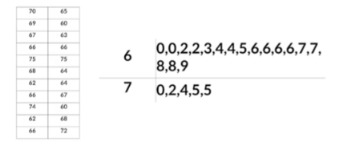
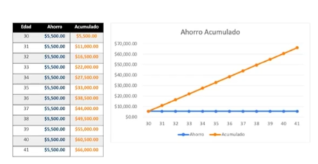
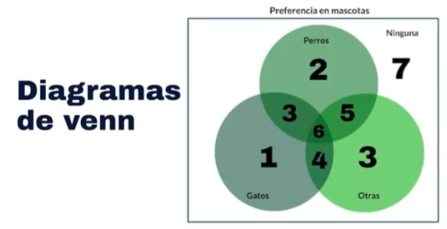
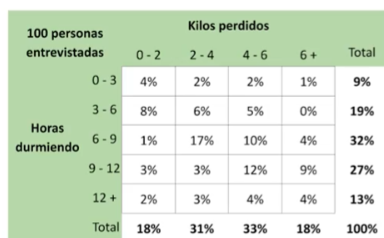
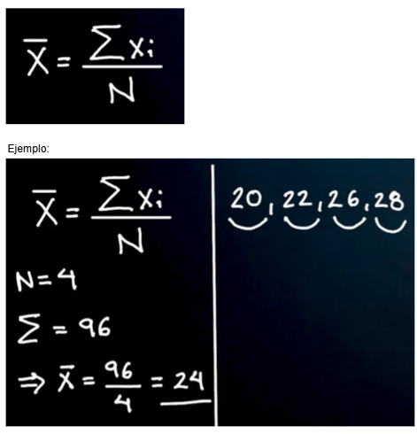
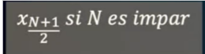
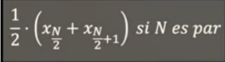
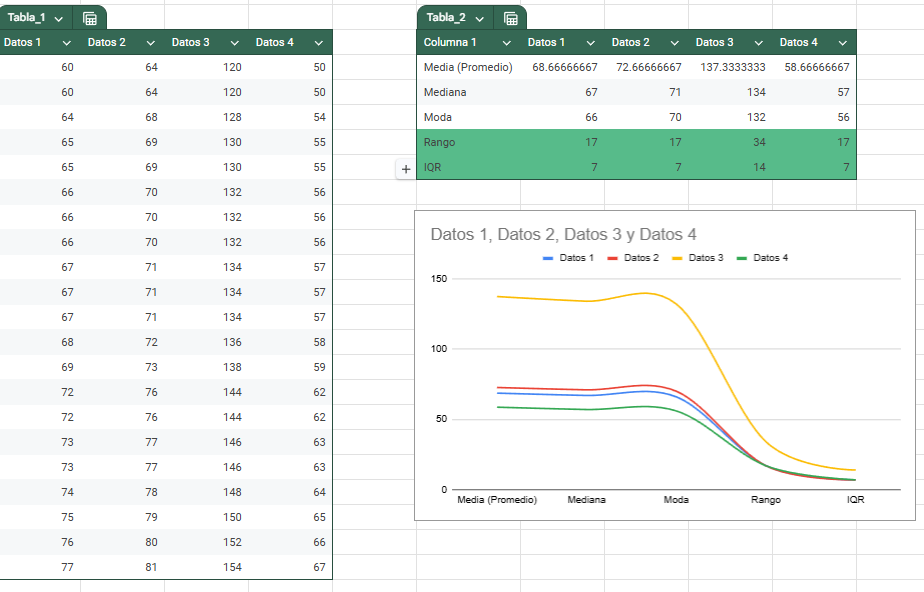
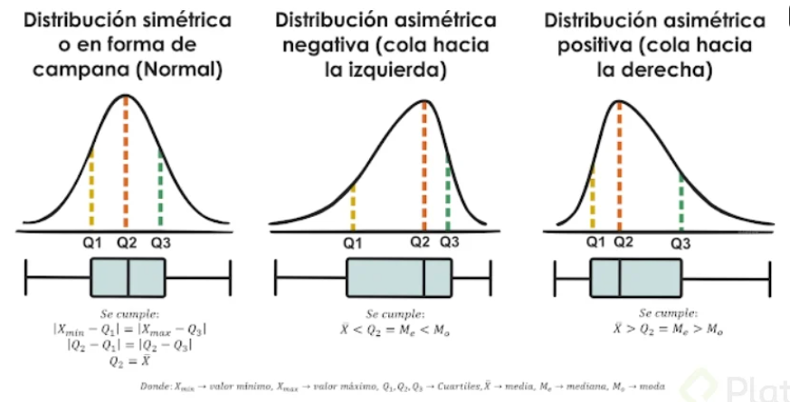

# Fundamentos de Estadística y Probabilidad

## Estadística

La **estadística** en el análisis de datos es una rama de la matemática que se encarga de recolectar, analizar, interpretar y presentar datos. Su objetivo principal es identificar patrones, tendencias y relaciones dentro de los datos para tomar decisiones informadas.

En el contexto del análisis de datos, la estadística se divide en dos grandes áreas:

1. **Estadística descriptiva**: Se enfoca en resumir y describir las características principales de un conjunto de datos. Utiliza medidas como la media, la mediana, la moda, la desviación estándar, entre otras, para proporcionar una visión clara y concisa de los datos.

2. **Estadística inferencial**: Se utiliza para hacer predicciones o inferencias sobre una población a partir de una muestra de datos. Emplea técnicas como pruebas de hipótesis, intervalos de confianza y regresión para generalizar los resultados obtenidos de la muestra a toda la población.

La estadística es fundamental en el análisis de datos porque permite transformar grandes volúmenes de datos en información útil y accionable, facilitando la toma de decisiones basadas en evidencia.

## **Conceptos Clave**

### **Datos**

Los datos se leen mejor en tablas, entonces se procede a ordenar los datos en una tabla.

Los datos a estudiar son:

* Los individuos: que son los objetos de estudio.
* Las variables: que son las características que posee el objeto.

        Ejemplo:

        * Individuos → personas
        * Variables → altura (m)

> 

### **Variables**

* **Variables cuantitativas (numéricas):**

    - Discretas: Pueden contarse y toman valores enteros (por ejemplo, el número de hijos).
    - Continuas: Pueden tomar cualquier valor dentro de un rango, incluyendo decimales (por ejemplo, la altura).

* **Variables cualitativas (categóricas):**

    - Nominales: No tienen un orden intrínseco (por ejemplo, el color de los ojos).
    - Ordinales: Tienen un orden o jerarquía (por ejemplo, las clasificaciones de satisfacción: baja, media, alta).

* **Niveles de medida:**
    - Nominal: Categorías sin orden (por ejemplo, tipos de frutas).
    - Ordinal: Categorías con un orden (por ejemplo, niveles de educación).
    - De intervalo: Tienen un orden y la diferencia entre valores es significativa, pero no tienen un cero absoluto (por ejemplo, la temperatura en grados Celsius).
    - De proporción: Tienen un orden, la diferencia entre valores es significativa y tienen un cero absoluto (por ejemplo, la altura, el peso).

            Ejemplo de variables cualitativas:

            * Individuos → 6 tipos de maletas.
            * Variable cuatitativa → Cantidad de maletas.
            * Variable cualitativa → El color de maleta y si tiene o no rueditas.

>

        Ejemplo de niveles de medidas:

        Tenemos en el ejemplo:

        * 2 individuos → 2 departamentos
        * Variables → 19

>

## **Software Estadístico**

* **Hojas de cálculo**: Son archivos que se componen por libros. Los libros se componen por hojas, y las hojas se componen de celdas ubicadas en filas y columnas. Se pueden insertar datos (numéricos, de texto, fórmulas y/o imágenes) para generar tablas o gráficos e interpretar los datos.
  * Excel
  * Google Sheets
  * Numbers

* **Industria Open Source**:
  * R → Creadas por y para estadísticos.
  * Python → Software de desarrollo con librerías que ayudan en el análisis de datos.

* **Herramientas de BI y análisis**: Facilitan la interpretación y analítica de datos. Crean dashboards interactivos o gráficos de tendencia para hacer reportes de negocio entendibles.
  * Power BI
  * Tableau
  * Minitab
  * Looker

* **Industria paga**: Las empresas temen por la seguridad de los datos, por lo que usan software de paga.
  * SPSS → Genera tendencias de datos y visualizaciones simples.
  * SAS → Lenguaje de programación con usos como análisis, visualización y generación de modelos de inteligencia artificial o machine learning.

* **Academia**:
  * Matlab → Preferido por físicos y matemáticos. Modela y calibra modelos, también genera animaciones.
  * Stata → Enfocado en el área médica y política.

 ## **Tablas Unidimensionales y Bidimensionales**

Para identificar si la tabla es unidimensional o bidimensional, debo responder a la pregunta: ¿Cuántas preguntas me tengo que hacer para identificar el valor que estoy buscando?

- Las **tablas unidimensionales** son aquellas en las que con una pregunta podemos identificar el valor que se está buscando.
- Las **tablas bidimensionales** son aquellas en las que con dos preguntas podemos identificar el valor que se está buscando.

**Frecuencia Estadística**: La frecuencia nos indica las veces en las que se repite un valor dentro de un conjunto de datos.

**Frecuencia relativa**: Nos indica el valor convertido en porcentaje del total.

### **Visualización**

**Diagramas de tallo**

 Una tabla de tallos y hojas se utiliza para mostrar datos. El 'tallo' a la izquierda muestra el primer dígito o dígitos, en este caso las decenas. La 'hoja' a la derecha muestra el último dígito, es decir, las unidades.

>

**Gráfico de puntos**

Un diagrama de puntos muestra datos y sus frecuencias a lo largo de una recta numérica. Cada punto puede tomar el valor de una unidad o un valor representativo dentro de una escala.

**Gráfico de barras**

Un diagrama de barras es un gráfico usado para mostrar un grupo de datos repetidos (representa la frecuencia). Pueden tomar datos más grandes.

**Gráfico de barras horizontal**

Es recomendable usar el gráfico de barras horizontal si se quiere mostrar un orden específico, para mostrar los valores más representativos.

**Gráfico de pastel o circular (pie chart)**

Este diagrama también representa la frecuencia en un set de datos. Se puede tomar valores de la frecuencia total o frecuencia relativa.

**Gráfico de línea**

Los gráficos de líneas muestran puntos conectados mediante una línea. Es recomendable usar esta gráfica con muchos datos y que tienen lugar durante un período continuado de tiempo.

**Gráfico de ojiva**

Es similar al gráfico de línea, pero este representa acumulación respecto al tiempo.

>

**Diagramas de Venn**

Nos ayudan a acomodar los datos respecto a cierta preferencia o pertenencia. Es importante para las preferencias combinadas.

**Histograma**

Agrupa intervalos de tamaño o valor similar. Se usan rangos.

>

## **Estadística descriptiva**

La distribución conjunta es cómo se comporta una variable en relación a otra. Estas distribuciones son pensadas respecto a otra variable.

    Ejemplo: Entrevista a 100 individuos que tienen como hábito hacer ejercicio y se quiere relacionar las horas durmiendo respecto a los kilos perdidos en un mes.

    En la tabla conjunta bidimensional tenemos estas dos variables.

>

**Distribución marginal**

Es la distribución que está a los márgenes de nuestra tabla bidimensional.

Independientemente de la otra variable, se pueden hacer conclusiones específicas de mi variable de columnas o de mi variable de filas.

    Ejemplo:

    Podemos observar la distribución marginal sumando los totales de las filas y columnas.

    Si se quiere enfocar la distribución marginal respecto a los kilos perdidos, solo se necesitaría la última fila de la tabla (total). Marginal por columnas - Distribución por kilos perdidos.

**Distribución condicional**

Dada una variable, ¿qué pasa con la otra variable? Se hacen preguntas sobre una variable respecto a la otra.

    Ejemplo:

    Distribución condicional por filas → Las filas suman el 100%.

    De las personas que durmieron entre 3-6 horas, ¿cuánto porcentaje perdió entre 2-4 kilos?

**Medidas de tendencia central**

Las medidas de tendencia central son estadísticas que proporcionan un valor representativo o central de un conjunto de datos. Las medidas más comunes de tendencia central son la media, la mediana y la moda.

* **Media (promedio)**: La media es la suma de todos los valores en un conjunto de datos dividida por el número total de elementos. Se denota como "μ" (mu) para una población o "x̄" (x barra) para una muestra.

**Fórmula**: 
$$\mu = \frac{x₁ + x₂ + \ldots + x_n}{n}$$ 
$$\bar{x} = \frac{x₁ + x₂ + \ldots + x_n}{n}$$

>

**Mediana**: La mediana es el valor central en un conjunto de datos ordenados. Divide el conjunto de datos en dos partes iguales, donde la mitad de los valores están por encima y la otra mitad están por debajo. Es útil para resumir datos cuando hay valores atípicos o cuando el conjunto de datos no sigue una distribución simétrica.

**Fórmula**: Para un conjunto de datos ordenado de manera ascendente:
- **Impar**: La mediana es el valor en la posición \((n + 1) / 2\).
>
- **Par**: La mediana es el promedio de los dos valores centrales, en las posiciones \(n / 2\) y \((n / 2) + 1\).
>

    Ejemplo: 
    Consideremos el conjunto de datos: 5, 7, 9, 10, 12. El conjunto de datos ordenado sería: 5, 7, 9, 10, 12. La mediana sería el valor en la posición \((5 + 1) / 2 = 3\), que es 9.

**Moda**: La moda es el valor que ocurre con mayor frecuencia en un conjunto de datos. Puede haber una moda (unimodal) si un solo valor se repite con más frecuencia, o múltiples modas (multimodal) si varios valores tienen la misma frecuencia máxima. También puede haber casos donde no haya moda en absoluto (datos sin modas).

    Ejemplo: Consideremos el conjunto de datos: 2, 4, 4, 6, 8. En este caso, la moda es 4, ya que ocurre con mayor frecuencia en el conjunto de datos.

**Medidas de dispersión**

Las medidas de dispersión describen qué tan juntos o separados entre sí se encuentran los valores. Esta vez estudiaremos el rango e índice intercuartílico (IQR).

* **Rango**: Medida que nos indica la distancia de nuestros valores y se calcula restando: valor máximo - valor mínimo.
    **Formúla**
    $$\text{Rango} = \text{max} - \text{min}$$

* **Índice intercuartílico (RIQ o IQR)**: Diferencia entre el tercer y primer cuartil de una distribución.

    **Formúla:**
    $$\text{IQR} = Q3 - Q1$$

* **Cuartil**: Distribución en cuartiles o en cuartos de los datos.

## Desplazamiento y escala de valores

El desplazamiento y la escala de valores son modificaciones que les puede ocurrir a nuestros datos y esto afecta las medidas de dispersión y tendencia. Estos son los siguientes casos que se pueden presentar de desplazamiento y sus implicaciones en los datos:

1. **Desplazamiento (suma y resta).**
La media, la mediana y la moda se modificarán, si todos los datos de nuestra escala se suma o resta el mismo número, la media, mediana y moda tambien sufrirán de esta modificación.
El rango y el IQR no reciben ninguna modificación cuando todos los valores de nuestra tabla sufren la misma cantidad de sumatoria o resta.

2.**Escalar (multiplicación y división).**
Todas las medidas de dispersión y tendencia sufren una modificación, sin embargo, si todos los datos son multiplicados por la misma cifra, al multiplicar por dicha cifra nuestras medidas obtendremos el resultado.
Añadir o quitar un punto de datos en el conjunto.
En estos casos nuestras medidas cambian completamente dependiendo los datos que eliminemos, para asegurarnos de tener las medidas correctas debemos reformular todas las medidas. 
    
    Ejemplo: Si eliminamos el número que obtuvimos en la moda, puede que este ya no sea el valor que mas se repita, al eliminar o añadir un dato, tanto el rango como la mediana, la media y el IQR se dividen por otros números totales, dándonos un valor diferente al inicial.

>

## Boxplot o diagrama de caja

Este tipo de gráficos nos permite identificar valores atípicos y comparar distribuciones. Además de conocer de forma rápida como se distribuyen el 50% de los valores centrales.

Las ventajas  principales de representar la distribución de los datos utilizando este método son:

Visualizar si la distribución de una variable es asimétrica o se aleja de la distribución normal.
La facilidad al comparar distribuciones entre grupos. Aunque se tendrá que usar técnicas estadísticas para establecer la significación de las diferencias percibidas.
Interpretación:

Caja:

La caja está determinada por la distancia del rango cuartilico, que es la diferencia entre el primer y tercer cuartil. El segmento que divide a la caja es la mediana.

Si la mediana se sitúa en el centro de la caja, entonces la distribución es simétrica y tanto la media, mediana y moda coinciden.
Si la mediana corta la caja en dos lados desicuales se tiene:
Asimetría positiva o sesgada a la derecha si la parte más larga de la caja es la parte superior a la mediana. Los datos se concentran en la parte inferior de la distribución. La media suele ser mayor a la mediana.

Asimetría negativa o sesgada a la izquierda si la parte más larga es la inferior a la mediana. Los datos se concentran en la parte superior de la distribución. La media suele ser menor que la mediana.

>

💡 Que un lado de la caja sea más amplio que el otro, no quiere decir que contenga más datos, si no que los datos están más dispersos. Un rango menos amplio, indica que los datos están más próximos. </aside>
Bigotes:

Los Bigotes son las líneas verticales que se extienden desde la caja hasta los valores máximo y mínimo de la serie o 1.5 veces el IQR.

Valores átipicos (outliers):

Estos valores son aquellos que están más allá del límite inferior o superior.