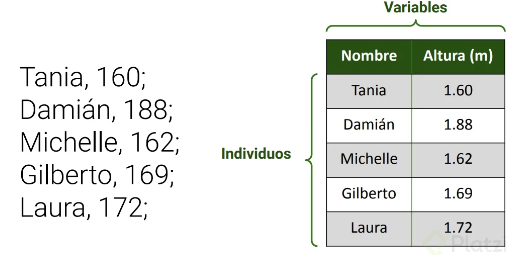
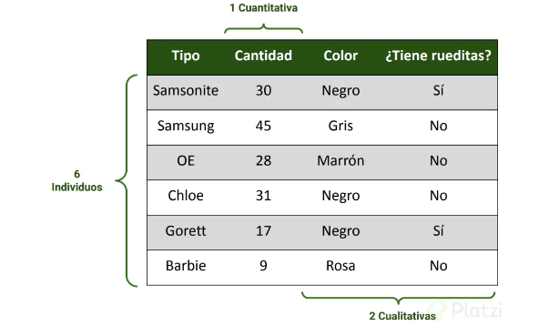
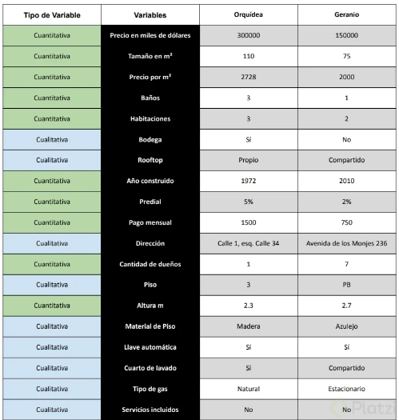

# Fundamentos de Estadística y Probabilidad

## Estadística

La **estadística** en el análisis de datos es una rama de la matemática que se encarga de recolectar, analizar, interpretar y presentar datos. Su objetivo principal es identificar patrones, tendencias y relaciones dentro de los datos para tomar decisiones informadas.

En el contexto del análisis de datos, la estadística se divide en dos grandes áreas:

1. **Estadística descriptiva**: Se enfoca en resumir y describir las características principales de un conjunto de datos. Utiliza medidas como la media, la mediana, la moda, la desviación estándar, entre otras, para proporcionar una visión clara y concisa de los datos.

2. **Estadística inferencial**: Se utiliza para hacer predicciones o inferencias sobre una población a partir de una muestra de datos. Emplea técnicas como pruebas de hipótesis, intervalos de confianza y regresión para generalizar los resultados obtenidos de la muestra a toda la población.

La estadística es fundamental en el análisis de datos porque permite transformar grandes volúmenes de datos en información útil y accionable, facilitando la toma de decisiones basadas en evidencia.

## **Conceptos Clave**

### **Datos**

Los datos se leen mejor en tablas, entonces se procede a ordenar los datos en una tabla.

Los datos a estudiar son:

* Los individuos: que son los objetos de estudio.
* Las variables: que son las características que posee el objeto.

En el ejemplo tenemos:

* Individuos → personas
* Variables → altura (m)

> 

### **Variables**

* **Variables cuantitativas (numéricas):**

    - Discretas: Pueden contarse y toman valores enteros (por ejemplo, el número de hijos).
    - Continuas: Pueden tomar cualquier valor dentro de un rango, incluyendo decimales (por ejemplo, la altura).

* **Variables cualitativas (categóricas):**

    - Nominales: No tienen un orden intrínseco (por ejemplo, el color de los ojos).
    - Ordinales: Tienen un orden o jerarquía (por ejemplo, las clasificaciones de satisfacción: baja, media, alta).

* **Niveles de medida:**
    - Nominal: Categorías sin orden (por ejemplo, tipos de frutas).
    - Ordinal: Categorías con un orden (por ejemplo, niveles de educación).
    - De intervalo: Tienen un orden y la diferencia entre valores es significativa, pero no tienen un cero absoluto (por ejemplo, la temperatura en grados Celsius).
    - De proporción: Tienen un orden, la diferencia entre valores es significativa y tienen un cero absoluto (por ejemplo, la altura, el peso).

En el ejemplo de variables cualitativas:

* Individuos → 6 tipos de maletas.
* Variable cuatitativa → Cantidad de maletas.
* Variable cualitativa → El color de maleta y si tiene o no rueditas.

>

Ejemplo de niveles de medidas:

Tenemos en el ejemplo:

* 2 individuos → 2 departamentos
* Variables → 19

>

## **Software Estadístico**

* **Hojas de cálculo**: Son archivos que se componen por libros. Los libros se componen por hojas, y las hojas se componen de celdas ubicadas en filas y columnas. Se pueden insertar datos (numéricos, de texto, fórmulas y/o imágenes) para generar tablas o gráficos e interpretar los datos.
  * Excel
  * Google Sheets
  * Numbers

* **Industria Open Source**:
  * R → Creadas por y para estadísticos.
  * Python → Software de desarrollo con librerías que ayudan en el análisis de datos.

* **Herramientas de BI y análisis**: Facilitan la interpretación y analítica de datos. Crean dashboards interactivos o gráficos de tendencia para hacer reportes de negocio entendibles.
  * Power BI
  * Tableau
  * Minitab
  * Looker

* **Industria paga**: Las empresas temen por la seguridad de los datos, por lo que usan software de paga.
  * SPSS → Genera tendencias de datos y visualizaciones simples.
  * SAS → Lenguaje de programación con usos como análisis, visualización y generación de modelos de inteligencia artificial o machine learning.

* **Academia**:
  * Matlab → Preferido por físicos y matemáticos. Modela y calibra modelos, también genera animaciones.
  * Stata → Enfocado en el área médica y política.

 ### **Tablas Unidimensionales y Bidimensionales**

Para identificar si la tabla es unidimensional o bidimensional, debo responder a la pregunta: ¿Cuántas preguntas me tengo que hacer para identificar el valor que estoy buscando?

- Las **tablas unidimensionales** son aquellas en las que con una pregunta podemos identificar el valor que se está buscando.
- Las **tablas bidimensionales** son aquellas en las que con dos preguntas podemos identificar el valor que se está buscando.

**Frecuencia Estadística**: La frecuencia nos indica las veces en las que se repite un valor dentro de un conjunto de datos.

**Frecuencia relativa**: Nos indica el valor convertido en porcentaje del total.

### **Visualización**

- **Diagramas de tallo**: Una tabla de tallos y hojas se utiliza para mostrar datos. El 'tallo' a la izquierda muestra el primer dígito o dígitos, en este caso las decenas. La 'hoja' a la derecha muestra el último dígito, es decir, las unidades.

